**program:**

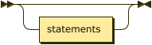

```
program  ::= statements?
```

**statements:**

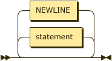

```
statements
         ::= ( statement | NEWLINE )*
```

referenced by:

* block
* program

**statement:**

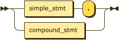

```
statement
         ::= simple_stmt '.'
           | compound_stmt
```

referenced by:

* block
* statements

**simple_stmt:**

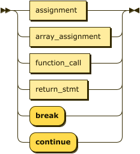

```
simple_stmt
         ::= assignment
           | array_assignment
           | function_call
           | return_stmt
           | 'break'
           | 'continue'
```

referenced by:

* statement

**compound_stmt:**

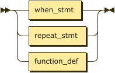

```
compound_stmt
         ::= when_stmt
           | repeat_stmt
           | function_def
```

referenced by:

* statement

**block:**

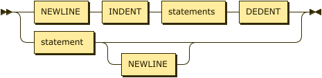

```
block    ::= NEWLINE INDENT statements DEDENT
           | statement NEWLINE?
```

referenced by:

* function_def
* repeat_stmt
* when_stmt

**assignment:**

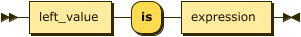

```
assignment
         ::= left_value 'is' expression
```

referenced by:

* simple_stmt

**array_assignment:**

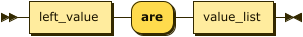

```
array_assignment
         ::= left_value 'are' value_list
```

referenced by:

* simple_stmt

**left_value:**

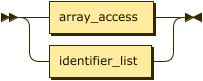

```
left_value
         ::= array_access
           | identifier_list
```

referenced by:

* array_assignment
* assignment

**identifier_list:**

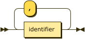

```
identifier_list
         ::= identifier ( ',' identifier )*
```

referenced by:

* function_def
* left_value

**return_stmt:**

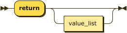

```
return_stmt
         ::= 'return' value_list?
```

referenced by:

* simple_stmt

**when_stmt:**

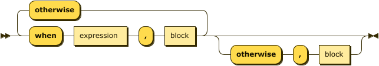

```
when_stmt
         ::= 'when' expression ',' block ( 'otherwise' 'when' expression ',' block )* ( 'otherwise' ',' block )?
```

referenced by:

* compound_stmt

**repeat_stmt:**

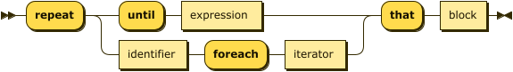

```
repeat_stmt
         ::= 'repeat' ( 'until' expression | identifier 'foreach' iterator ) 'that' block
```

referenced by:

* compound_stmt

**iterator:**

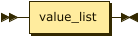

```
iterator ::= value_list
```

referenced by:

* repeat_stmt

**function_def:**

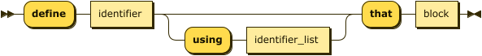

```
function_def
         ::= 'define' identifier ( 'using' identifier_list )? 'that' block
```

referenced by:

* compound_stmt

**function_call:**

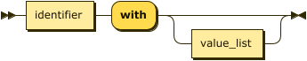

```
function_call
         ::= identifier 'with' value_list?
```

referenced by:

* atom
* simple_stmt

**expression:**

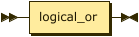

```
expression
         ::= logical_or
```

referenced by:

* assignment
* atom
* fstring_part
* repeat_stmt
* when_stmt

**logical_or:**

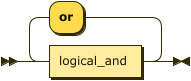

```
logical_or
         ::= logical_and ( 'or' logical_and )*
```

referenced by:

* expression

**logical_and:**

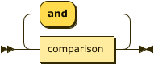

```
logical_and
         ::= comparison ( 'and' comparison )*
```

referenced by:

* logical_or

**comparison:**

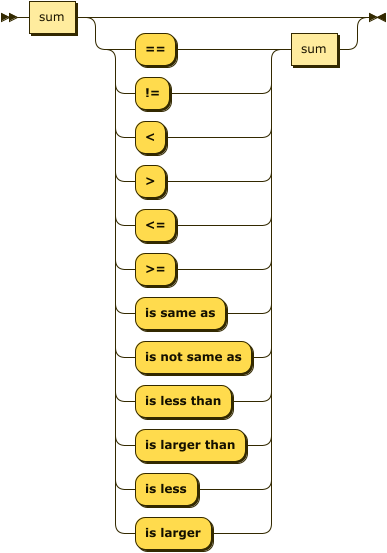

```
comparison
         ::= sum ( ( '==' | '!=' | '<' | '>' | '<=' | '>=' | 'is same as' | 'is not same as' | 'is
                  less than' | 'is larger than' | 'is less' | 'is larger' ) sum )?
```

referenced by:

* logical_and

**sum:**

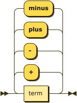

```
sum      ::= term ( ( '+' | '-' | 'plus' | 'minus' ) term )*
```

referenced by:

* comparison
* slice_range
* value_list

**term:**

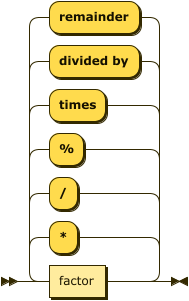

```
term     ::= factor ( ( '*' | '/' | '%' | 'times' | 'divided by' | 'remainder' ) factor )*
```

referenced by:

* sum

**factor:**

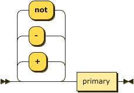

```
factor   ::= ( '+' | '-' | 'not' )* primary
```

referenced by:

* term

**primary:**

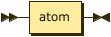

```
primary  ::= atom
```

referenced by:

* factor

**atom:**

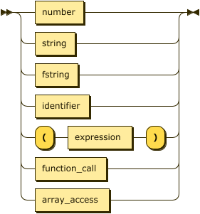

```
atom     ::= number
           | string
           | fstring
           | identifier
           | '(' expression ')'
           | function_call
           | array_access
```

referenced by:

* array_access
* primary

**value_list:**

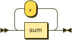

```
value_list
         ::= sum ( ',' sum )*
```

referenced by:

* array_assignment
* function_call
* iterator
* return_stmt

**array_access:**

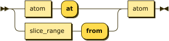

```
array_access
         ::= ( atom 'at' | slice_range 'from' ) atom
```

referenced by:

* atom
* left_value

**slice_range:**

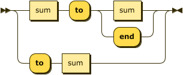

```
slice_range
         ::= sum 'to' ( sum | 'end' )
           | 'to' sum
```

referenced by:

* array_access

**fstring:**

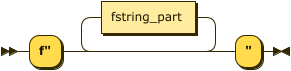

```
fstring  ::= 'f"' fstring_part* '"'
```

referenced by:

* atom

**fstring_part:**

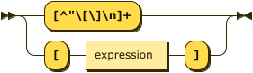

```
fstring_part
         ::= '[^"\[\]\n]+'
           | '[' expression ']'
```

referenced by:

* fstring

**identifier:**


```
identifier
         ::= [a-zA-Z_] [a-zA-Z0-9_]*
```

referenced by:

* atom
* function_call
* function_def
* identifier_list
* repeat_stmt

**number:**

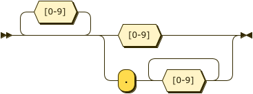

```
number   ::= [0-9]* ( [0-9] | '.' [0-9]+ )
```

referenced by:

* atom

**string:**

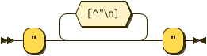

```
string   ::= '"' [^"\n]* '"'
```

referenced by:

* atom

**NEWLINE:**

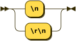

```
NEWLINE  ::= '\n'
           | '\r\n'
```

referenced by:

* block
* statements

**INDENT:**

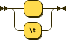

```
INDENT   ::= '    '
           | '\t'
```

referenced by:

* block

## 
 <sup>generated by [RR - Railroad Diagram Generator][RR]</sup>

[RR]: https://www.bottlecaps.de/rr/ui
